# PRÁCTICÁ 1. Introduccion a los lenguajes de marcas. Markdown

# Actividad 1
Markdown se trata de un  lenguaje de marcado ligero que sirve frecuentemente para formatear texto en documentos, 
especialmente en la documentación de proyectos de software.También fue creado por John Gruber y 
Aaron Swartz en el año 2004.

Algunas razones de  porque utilizar markdown en la documentación de nuestros proyectos las cuales son:

Sencillez: Markdown es fácil de aprender y usar. No hace falta tener conocimientos técnicos avanzados y utiliza una sintaxis sencilla basada en texto plano.

Legibilidad: Los documentos escritos en Markdown son legibles en su forma sin formato y se ven bien formateados cuando se convierten a HTML u otros formatos. Esto facilita la lectura y la colaboración.

Adaptabilidad: Markdown es compatible con varias plataformas, editores de texto y herramientas de generación de documentación. Esto significa que puede escribir en Markdown en un lugar y luego convertirlo a otros formatos según sea necesario.

Control de versión: Como Markdown es texto plano , es fácil de gestionar con sistemas de control de versiones como, por ejemplo, Git. Esto facilita el seguimiento de cambios en la documentación a lo largo del tiempo.

Un amplio uso: Markdown es un crecimiento aceptado en la comunidad de desarrollo de software y se utiliza en plataformas populares como, por ejemplo, GitHub y GitLab, para formatear la documentación.


# Actividad 2
# Markdown
## ¿Qué es Markdown y por qué usarlo en la documentación de nuestros proyectos?

Markdown se trata de un  **lenguaje de marcado ligero** que sirve frecuentemente para formatear texto en documentos, 
especialmente en la documentación de proyectos de software.También fue creado por John Gruber y 
Aaron Swartz en el año 2004.

Algunas razones de  porque utilizar markdown en la documentación de nuestros proyectos las cuales son:

**Sencillez**: Markdown es *fácil de aprender y usar*. No hace falta tener conocimientos técnicos *avanzados* y *utiliza una sintaxis sencilla* basada en texto plano.

**Legibilidad**: Los documentos escritos en Markdown son *legibles* en su forma sin formato y se ven bien formateados cuando se convierten a HTML u otros formatos. Esto facilita la lectura y la colaboración.

**Adaptabilidad**: Markdown es *compatible con varias plataformas*, editores de texto y herramientas de generación de documentación. Esto significa que puede escribir en Markdown en un lugar y luego **convertirlo a otros formatos** según sea necesario.

**Control de versión**: Como Markdown es texto plano , es *fácil de gestionar* con sistemas de control de versiones como, por ejemplo, *Git*. Esto **facilita el seguimiento de cambios** en la documentación a lo largo del tiempo.

**Un amplio uso**: Markdown es un crecimiento aceptado en la comunidad de desarrollo de software y se **utiliza en plataformas populares** como, por ejemplo, *GitHub* y *GitLab*, para formatear la documentación.

## Trozo de codigo

```markdown
# Titulo
Listas ordenadas
1. elemento 1
2. elemento 2
3. elemneto 3

**Esta parte esta en negrita**
*Esta parte esta en cursiva*
```


## Listas desordenadas y ordenadas sobres las razones de utilizar markdown

### Listas desordenadas

- Sencillez
- Legibilidad
- Adaptabilidad

### Listas ordenadas

1. Control de versión
2. Un amplio uso

## Enlaces
[Enlaces a mas informacion de Markdown](https://qabiria.com/es/recursos/blog/que-es-markdown-y-como-utilizarlo)

[Enlace a otro fichero markdown existente llamado fichero-existente.md](https://github.com/asecval543/Tarea-Markdown/blob/main/fichero-existente.md)

## Imagen


## Tabla
| Ventajas de Markdown         | Desventajas de Markdown   |
|------------------------------|---------------------------|
| Fácil de aprender y usar     | Limitado en funcionalidad |
| Texto plano y legible        | Carece de características avanzadas de diseño |
| Compatible con la mayoría de los editores de texto | No es adecuado para proyectos de diseño gráfico complejo |
| Ligero y rápido de procesar  | Puede ser limitado en la creación de documentos estructurados |
| Ampliamente compatible en la web | No es tan comúnmente conocido como otros formatos de archivo |
| Ideal para documentación técnica y notas rápidas | No es la mejor opción para documentos con diseño elaborado |
| Puede ser convertido fácilmente a otros formatos (por ejemplo, HTML o PDF) | Requiere conocimiento adicional para incrustar contenido multimedia |


# Actividad 3

 Una herramienta para convertir mi  documento a HTML y comparar ambos archivos es pandoc y para  convertir  mi docuemnto markdown.md a html  pongo  en el terminal el siguiente comando pandoc markdown.md -o markdown.html   la opcion -o indica que a que se especifica el nombre del archivo de salida en este caso el seria markdown.html.

 Archivo markdown.md
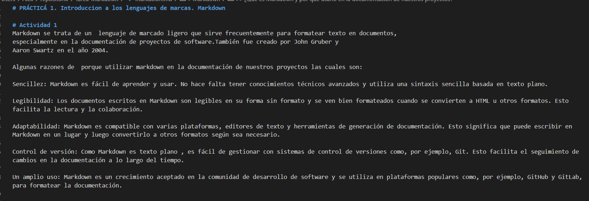

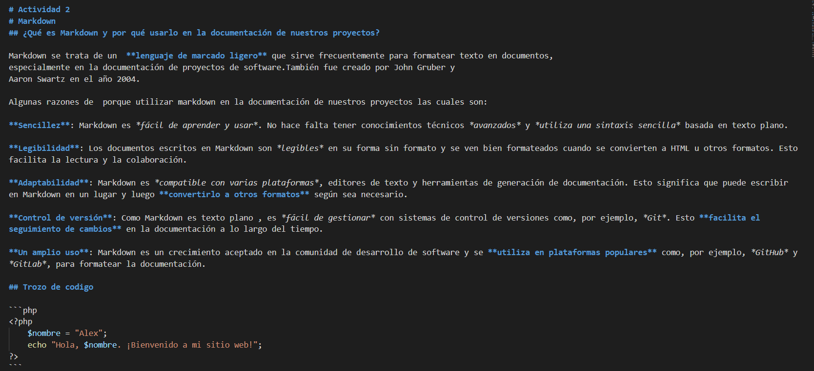

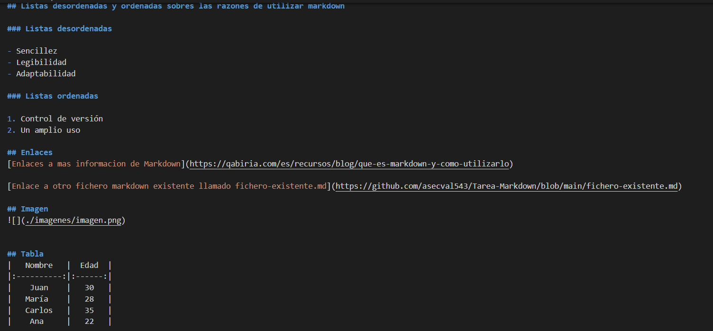

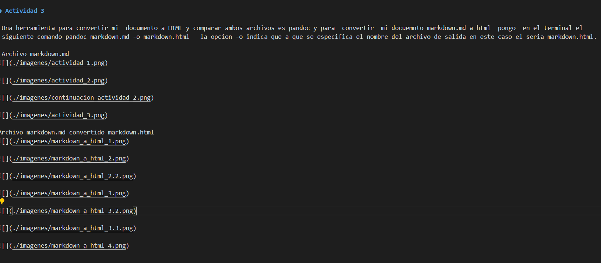

Archivo markdown.md convertido markdown.html
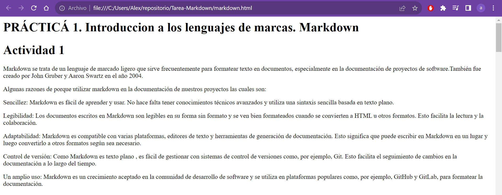

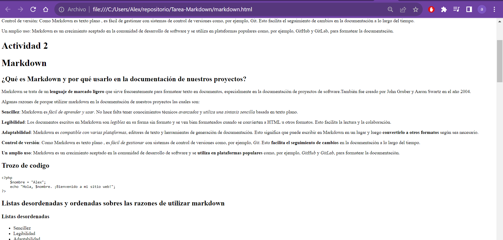

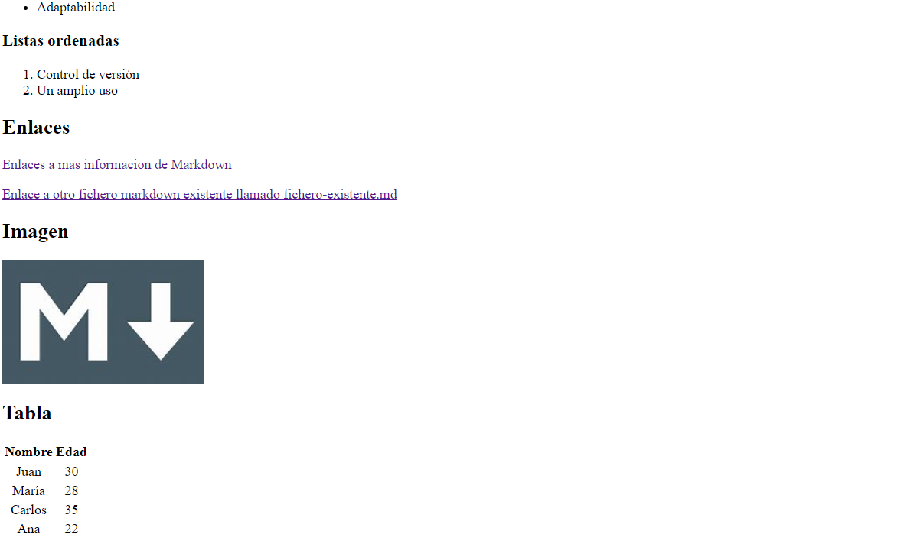

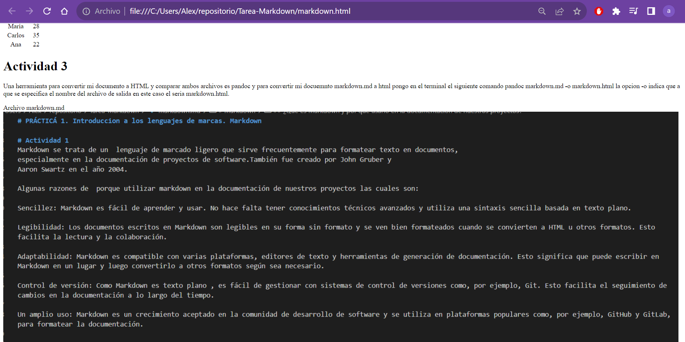

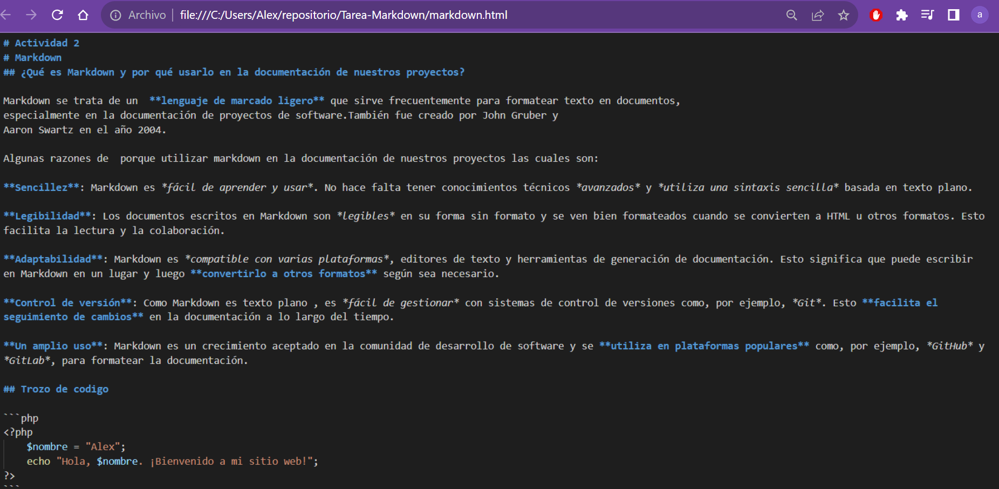

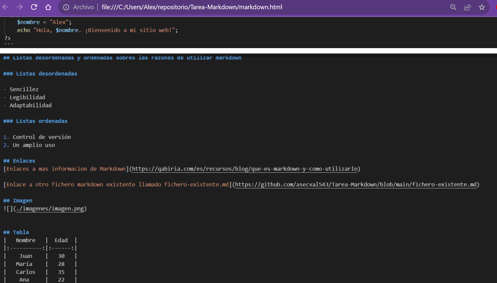

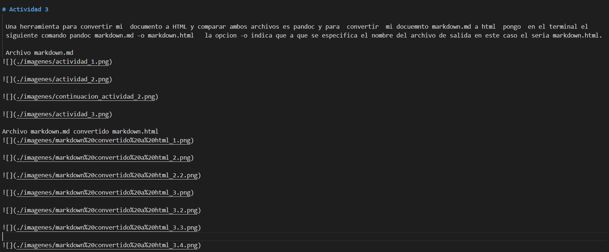
